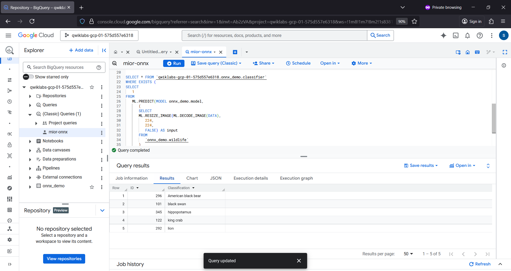
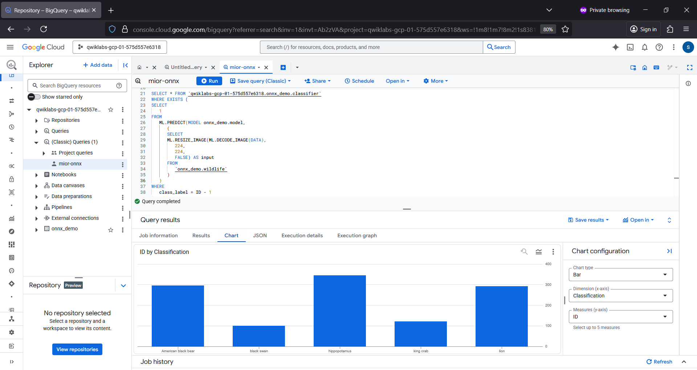
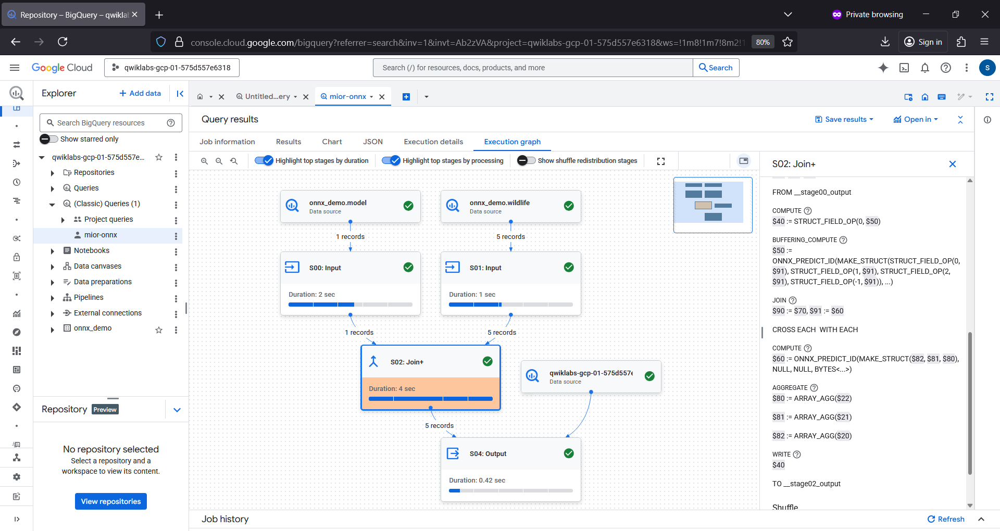
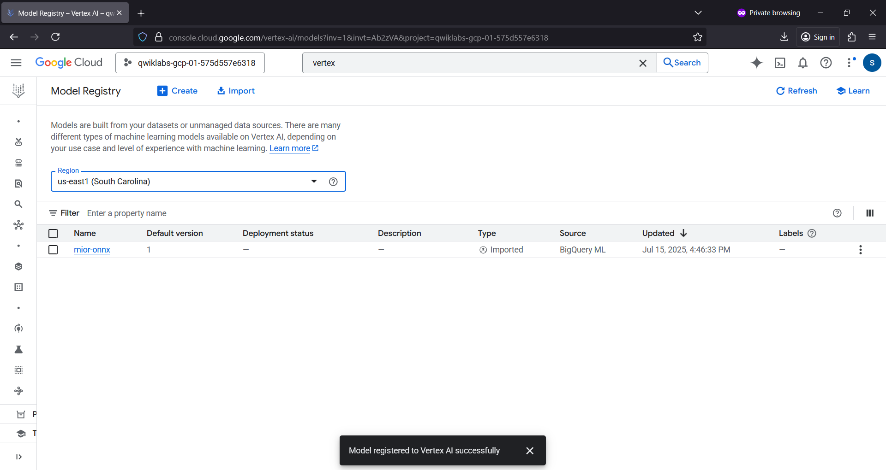

# onnxwildlife 🐻🦢
onnxwildlife : PyTorch Image Classification Model # BigQuery # ONNX

## Objective
- Classify images using the ONNX model via BigQuery.

## Wild Life Image Classification using PyTorch ONNX Model

